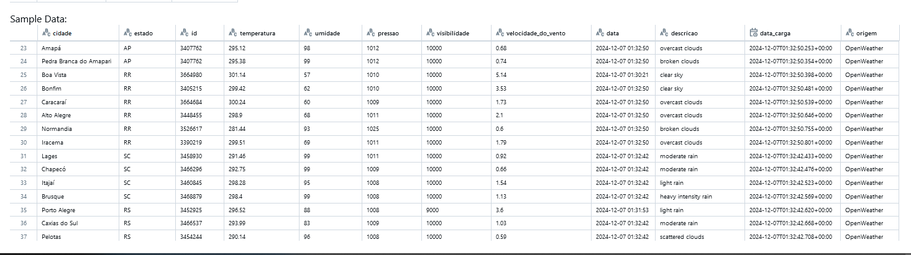

# Pipeline - Dados Climáticos do Brasil
#
# Criação da Tabela Bronze

O código a seguir descreve um fluxo completo para a extração de dados climáticos de várias cidades brasileiras utilizando a API do OpenWeather, seguido de um processo de carga e organização dos dados dentro do Databricks. Este fluxo inclui a criação de um banco de dados para simulação de ambiente real, o uso de uma chave de API para acessar informações climáticas, o armazenamento dos dados extraídos e a criação de tabelas no formato Delta para análise futura. Vale ressaltar que, na versão *Community* do Databricks, não é possível utilizar o **KeyVault**, que é uma solução de segurança para armazenar e gerenciar chaves de API e outros segredos de forma segura. Dessa forma, será necessário adotar métodos alternativos para armazenar e utilizar a chave de API nas versões *Community* do Databricks, como o uso de variáveis de ambiente ou a inserção manual da chave no código, embora estas opções sejam menos seguras.


## 1. Criação do Banco de Dados no Databricks

```
#Criando o banco de dados

spark.sql("CREATE DATABASE IF NOT EXISTS db_clima_brasil")
```

## 2. Atribuindo a Chave da API do OpenWeather

É realizada a leitura da chave da API do OpenWeather a partir de um arquivo armazenado no Databricks File System (DBFS). A chave é necessária para autenticar as requisições à API do OpenWeather e obter os dados climáticos.
```
# Caminho para o arquivo no DBFS

file_path = "/FileStore/user_config/my_keys.txt"

df = spark.read.text(file_path)

api_key = df.head()[0]
```

## 3. Carregamento da Lista de Cidades Brasileiras para Consulta

Para reduzir um pouco a quantidade de dados para esse exemplo, iremos coletar os dados climáticos de algumas cidades brasileiras. Para isso criremos uma lista de cidades brasileiras utilizando um carga através de um arquivo CSV contendo o nome das cidades e seus respectivos estados.
```
# Carregando os dados das cidades brasileiras

cidades_brasil = spark \
.read \
.csv('dbfs:/FileStore/Cidades_Brasil/Lista_de_10_cidades_Brasil.csv', 
    header=True,
    inferSchema=True)
```
## 4. Extração dos Dados Climáticos para Cada Cidade

Utilizaremos a API do OpenWeather para obter os dados climáticos de cada cidade da lista.
```
#Extração dos dados via API OpenWeather

def obter_dados_climaticos(cidade, estado, chave_api):
    
    url = f"https://api.openweathermap.org/data/2.5/weather?q={cidade},{estado},BR&appid={api_key}"
    
    resposta = requests.get(url)
    
    if resposta.status_code == 200:
        dados = resposta.json()
        clima = {
            "cidade": cidade,
            "estado": estado,
            "id": dados["id"],
            "temperatura": dados["main"]["temp"],
            "umidade": dados["main"]["humidity"],
            "pressao": dados["main"]["pressure"],
            "visibilidade": dados["visibility"],
            "velocidade_do_vento": dados["wind"]["speed"],
            "data": datetime.utcfromtimestamp(dados['dt']).strftime('%Y-%m-%d %H:%M:%S'),
            "descricao": dados["weather"][0]["description"],
            "data_carga": datetime.now(),
            "origem": "OpenWeather"
        }
        return clima
    else:
        print(f"Erro ao acessar a API para {cidade} - {estado}")
        return None

# Inicializa a sessão Spark

spark = SparkSession.builder.appName("Pipeline_Clima_Brasil").getOrCreate()

# Lista para armazenar os dados

dados_climaticos = []

# Coleta os dados para todas as cidades

for cidade, uf,estado in cidades_brasil.collect():
    dados = obter_dados_climaticos(cidade, uf, api_key)
    if dados:
        dados_climaticos.append(dados)


# Cria DataFrame com os dados coletados

df_bronze = spark.createDataFrame(dados_climaticos,schema)
```

Resultado da extração com sucesso.


## 5. Armazenamento dos Dados em Tabela Delta (Bronze)

Depois de coletar os dados climáticos de todas as cidades, estes são armazenados em um DataFrame do Spark. Este DataFrame é então salvo em uma tabela Delta no Databricks. A tabela é denominada como clima_brasil_bronze, que é uma tabela do tipo "bronze", ou seja, uma tabela de dados brutos, que pode ser posteriormente refinada para análises mais específicas.
```
# Salvar Bronze em Delta Table

caminho_bronze = "/mnt/delta/bronze/raw_data"

df_bronze \
.write \
.format("delta") \
.mode("overwrite") \
.save(caminho_bronze)
```

Nesta etapa, os dados são armazenados em formato Parquet no Databricks File System (DBFS), utilizando a arquitetura Delta para garantir a integridade e a performance da consulta.

## 6. Criação da Tabela no Metastore Delta

Finalmente, o código cria a tabela Delta no Metastore do Databricks, permitindo que os dados sejam consultados diretamente via SQL e sejam acessíveis por outras aplicações.

Criação a tabela clima_brasil_bronze no banco de dados db_clima_brasil, tornando os dados disponíveis para futuras análises e transformações.

```
# Criando a tabela Delta no Metastore

spark.sql(f"""

CREATE TABLE IF NOT EXISTS clima_brasil_bronze

USING DELTA

LOCATION '{caminho_bronze}'

`""")
```
Esquema da tabela Bronze


Amostragem de registros da tabela Bronze



#
#
# Criação da Tabela Silver

Nesta etapa, com os dados brutos extraídos de uma origem pública, realizaremos a transformação, o enriquecimento ,a limpeza de dados inválidos e,finalmente, o armazenamento da tabela Silver em um Delta Lake

## 1. Obtendo os dados da camada Bronze

A leitura dos dados é realizada através de uma consulta SQL, que acessa a tabela clima_brasil_bronze no banco de dados db_clima_brasil.

`df_clima_brasil_bronze = spark.sql(f"""
select * from db_clima_brasil.clima_brasil_bronze
""")`

## 2. Transformação dos dados para a camada Silver

Após a obtenção dos dados brutos, iniciamos a transformação para a camada Silver, que envolve renomeação de colunas, alteração de tipos de dados e o arredondamento de valores. Além disso, novos campos são gerados para ajustar a granularidade temporal e a consistência dos dados. 


`# Renomeando as colunas e ajustando os tipos`

```
from pyspark.sql.functions import round,col, to_timestamp, date_format,current_timestamp

df_clima_brasil_silver = df_clima_brasil_bronze \
    .withColumnRenamed("estado", "uf") \
    .withColumnRenamed("cidade", "nome_da_cidade") \
    .withColumn("id", col("id").cast("int")) \
    .withColumn("temperatura", col("temperatura").cast("float")) \
    .withColumn("temperatura", round(col("temperatura"), 2)) \
    .withColumn("umidade", col("umidade").cast("int")) \
    .withColumn("pressao", col("pressao").cast("int")) \
    .withColumn("visibilidade", col("visibilidade").cast("int")) \
    .withColumn("velocidade_do_vento", col("velocidade_do_vento").cast("float")) \
    .withColumn("velocidade_do_vento", round(col("velocidade_do_vento"), 2)) \
    .withColumn("data", to_timestamp(col("data"), "yyyy-MM-dd HH:mm:ss")) \
    .withColumn("data_carga_bronze", to_timestamp(col("data_carga"), "yyyy-MM-dd HH:mm:ss")) \
    .withColumn("data_transformacao_silver", current_timestamp())
```
Modificações nos campos 


## 3. Enriquecimento com novos campos e remoção de redundâncias

Na etapa seguinte, os dados são enriquecidos com informações adicionais, como o nome completo do estado a partir da sigla da unidade federativa (UF). Isso é feito através de um join com um DataFrame contendo as siglas dos estados e seus nomes. Além disso, é adicionado o valor fixo "BRASIL" na coluna pais. A coluna data_carga é removida, pois estava redundante com a informação já presente na tabela.


```
from pyspark.sql import functions as F

#Gerar Lista de Estados

ufs_estados = [
    ("AC", "ACRE"), ("AL", "ALAGOAS"), ("AM", "AMAZONAS"), ("AP", "AMAPÁ"), ("BA", "BAHIA"),
    ("CE", "CEARÁ"), ("DF", "DISTRITO FEDERAL"), ("ES", "ESPÍRITO SANTO"), ("GO", "GOIÁS"),
    ("MA", "MARANHÃO"), ("MT", "MATO GROSSO"), ("MS", "MATO GROSSO DO SUL"), ("MG", "MINAS GERAIS"),
    ("PA", "PARÁ"), ("PB", "PARAÍBA"), ("PE", "PERNAMBUCO"), ("PI", "PIAUÍ"), ("PR", "PARANÁ"),
    ("RJ", "RIO DE JANEIRO"), ("RN", "RIO GRANDE DO NORTE"), ("RS", "RIO GRANDE DO SUL"),
    ("RO", "RONDÔNIA"), ("RR", "RORAIMA"), ("SC", "SANTA CATARINA"), ("SP", "SÃO PAULO"),
    ("SE", "SERGIPE"), ("TO", "TOCANTINS")
]

# Criar um DataFrame com o mapeamento das UFs e seus respectivos estados

ufs_estados_df = spark.createDataFrame(ufs_estados, ["uf", "nome_estado"])

# Realizar o join entre o DataFrame original e o de mapeamento
df_clima_brasil_silver = df_clima_brasil_silver.join(ufs_estados_df, on="uf", how="left")

#Inclusão do País
df_clima_brasil_silver = df_clima_brasil_silver.withColumn("pais", 
F.lit("BRASIL"))

#Exclusão do campo data de carga que está duplicado
df_clima_brasil_silver = df_clima_brasil_silver.drop("data_carga")

```
## 4. Limpeza de dados inválidos

A limpeza de dados inválidos é crucial para garantir a qualidade dos dados. Nesta etapa, as linhas com valores nulos nas colunas nome_da_cidade, id, uf e data são removidas. Além disso, as colunas restantes que contêm valores nulos são preenchidas com valores padrão, como 0 para valores numéricos ou strings vazias para colunas de texto.

```
from pyspark.sql import functions as F

# Remover linhas com valores nulos nas colunas 'nome_da_cidade', 'uf', 'data'
df_clima_brasil_silver_cleaned = df_clima_brasil_silver \
    .dropna(subset=["nome_da_cidade","id", "uf", "data"])

# Preencher os valores nulos nas demais colunas com 0 ou valores padrão apropriados
df_clima_brasil_silver_cleaned = df_clima_brasil_silver_cleaned \
    .fillna({
        "temperatura": 0.0,
        "umidade": 0,
        "pressao": 0,
        "visibilidade": 0,
        "velocidade_do_vento": 0.0,
        "descricao": "",
        "data_carga_bronze": "1970-01-01 00:00:00",  # Definindo como timestamp padrão
        "origem": ""
    })

#Atribuindo ao dafaframe da tabela Silver os dados corrigidos
df_clima_brasil_silver = df_clima_brasil_silver_cleaned
```
## 5. Armazenamento no Delta Lake

Por fim, a tabela tratada na camada Silver é salva em um Delta Lake. A tabela é armazenada no caminho especificado e posteriormente registrada no Metastore para facilitar o acesso e o gerenciamento dentro do Databricks.

```
# Salvar o Dataframe df_clima_brasil_silver em Delta Table Silver
caminho_silver = "/mnt/delta/silver/clima_brasil_silver"

df_clima_brasil_silver \
    .write \
    .format("delta")\ 
    .mode("overwrite") \
    .save(caminho_silver)


# Criar a tabela Delta Silver no Metastore

spark.sql("USE db_clima_brasil")
spark.sql(f"""
CREATE TABLE IF NOT EXISTS clima_brasil_silver
USING DELTA
LOCATION '{caminho_silver}'
""")


```

Esquema da tabela Silver


Amostragem de registros da tabela Silver


#
# Criação da Tabelas Golds


Criação da Tabela Wide e tabela agregada na camada Gold.

```
#Obter dados da Camada Silver

df_clima_brasil_silver = spark.sql(f"""
select * from db_clima_brasil.clima_brasil_silver
""")

df_clima_brasil_silver.printSchema()

```

## 2. Criação da Tabela Wide na Camada Gold

```
# Salvar a tabela como Delta na camada gold

caminho_gold = "/mnt/delta/gold/clima_brasil_gold"

df_clima_brasil_silver \
.write \
.format("delta") \
.mode("overwrite") \
.save(caminho_gold)

#Registrar a tabela fato_clima_brasil_gold no Metastore

spark.sql("USE db_clima_brasil")

spark.sql(f"""
CREATE TABLE IF NOT EXISTS clima_brasil_gold
USING DELTA
LOCATION '{caminho_gold}'
""")

```

<br><br>A tabela clima_brasil_gold é registrada no Metastore, permitindo que ela seja acessada de forma estruturada em consultas SQL futuras.<br><br>

Esquema da tabela Gold Wide


Amostragem de registros da tebela Gold Wide 


## 3. Criação da Tabela Agregada na Camada Gold


Agora, de acordo com as solicitações da área de negócio, os dados serão enriquecidos através de agregações para gerar informações úteis. A agregação é realizada por estado, calculando médias, mínimos, máximos e outras métricas relevantes.

```
from pyspark.sql import functions as F

# Realizar a agregação por estado

df_agg_clima_brasil_gold = df_clima_brasil_silver.groupBy("nome_estado") \
    .agg(
        F.round(F.avg("temperatura"), 2).alias("media_temperatura"),
        F.round(F.avg("umidade"), 2).alias("media_umidade"),
        F.round(F.avg("pressao"), 2).alias("media_pressao"),
        F.round(F.avg("velocidade_do_vento"), 2).alias("media_velocidade_do_vento"),
        F.min("data").alias("data_primeira_leitura"),
        F.max("data").alias("data_ultima_leitura"),
        F.countDistinct("nome_da_cidade").alias("qtd_cidades")
    )


# Adicionar coluna para registrar a data de transformação na camada gold

df_agg_clima_brasil_gold = df_agg_clima_brasil_gold \
.withColumn("data_transformacao_gold", F.current_timestamp())

# Definir o caminho da tabela Delta

caminho_gold = "/mnt/delta/gold/agg_clima_brasil_gold"

df_agg_clima_brasil_gold \
.write \
.format("delta") \
.mode("overwrite") \
.save(caminho_gold)

df_agg_clima_brasil_gold.show(2)

#Registrar a tabela agg_clima_brasil_gold no Metastore

spark.sql("USE db_clima_brasil")

spark.sql(f"""
CREATE TABLE IF NOT EXISTS agg_clima_brasil_gold
USING DELTA
LOCATION '{caminho_gold}'
""")

```

A  tabela agg_clima_brasil_gold foi registrada no Metastore. Isso permite que a tabela agregada seja acessada por outros usuários ou sistemas que utilizam o Databricks.

<br>

Esquema da tabela de agregação 


Amostragem de registros da tabela de agregação


## Conclusão

Este exemplo ilustra o fluxo completo de criação e processamento de dados climáticos do Brasil,
 desde a extração dos dados através da API do OpenWeather, 
até o armazenamento e transformação dos dados em três camadas no Databricks: Bronze, Silver, e Gold. 

A pipeline foi estruturada de maneira simplificada para fins de teste e treinamento, 
levando em consideração que o ambiente utilizado é limitado, como no caso da versão Community do Databricks, 
onde não é possível utilizar muitos recursos disponíveis na versão completa.
 
Essa pipeline, com essas e outras melhorias, poderia ser uma solução robusta, 
escalável e segura para um sistema de monitoramento climático de grande escala, 
fornecendo informações detalhadas e atualizadas para tomadas de decisão baseadas em dados.
